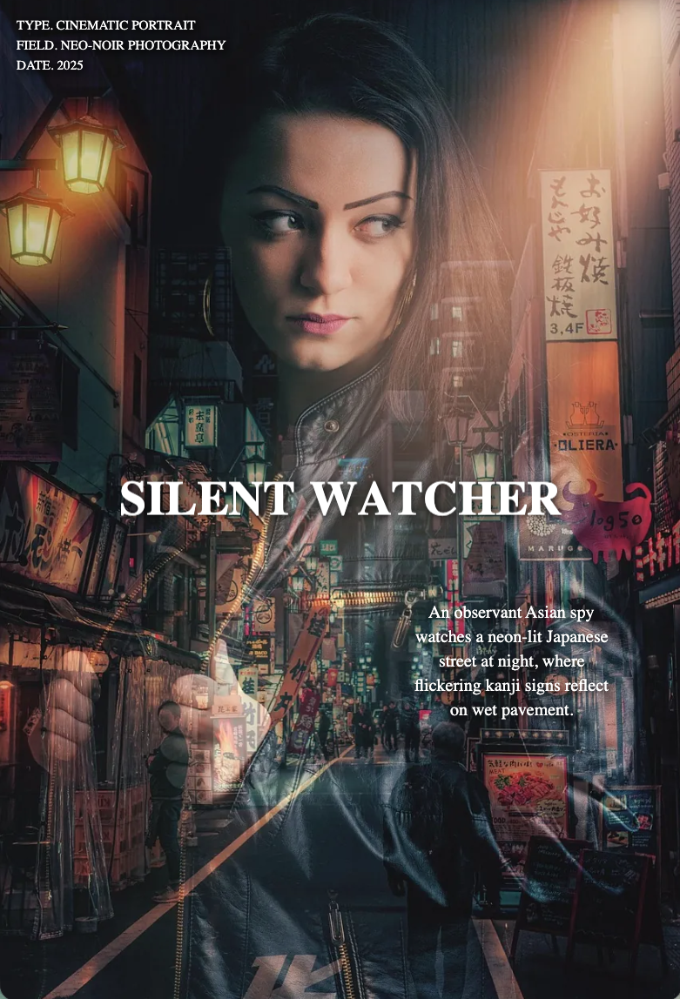

# 🌌 Warp Liquid Frames Slider

A **WebGL-powered image slider** featuring liquid warp transitions and dynamic text animations.  
Built with **React**, **Three.js**, and **GSAP**, it fuses real-time shader distortion with fluid typography transitions.

**🌐Live Demo:** [warp-liquid-frames-slider](https://three-js-shaders-warp-liquid-frames.vercel.app/)

<p align="center" width="100%">



</p>

---

## 🚀 Features

- 🎞️ **Liquid shader transitions** between images.
- ✨ **Animated typography** using GSAP and SplitText.
- 🧠 **Modular React architecture** with custom hooks.
- 🖼️ **Texture management** via Three.js.
- 📱 **Responsive WebGL canvas** resizing.
- 🖱️ **Click-to-advance navigation** between slides.

---

## 🧩 Tech Stack

| Technology                  | Purpose                                             |
| --------------------------- | --------------------------------------------------- |
| **React**                   | UI and component structure                          |
| **Three.js**                | WebGL rendering and texture blending                |
| **GSAP**                    | Animation engine                                    |
| **SplitText (GSAP plugin)** | Text splitting and per-character motion             |
| **Vite**                    | Modern bundler and dev server                       |
| **GLSL**                    | Vertex and fragment shaders for liquid warp effects |

---

## 🖌️ Shaders (GLSL)

    The project uses **custom shaders** to achieve the liquid warp effect between slides.

- Uniforms:

  - uTexture1, uTexture2: Textures of the current and next slides.

  - uProgress: Transition progress (0 → 1).

  - uResolution: Screen resolution for scaling calculations.

  - uTexture1Size, uTexture2Size: Original texture sizes for proper UV mapping.

- Includes:
  Reusable GLSL functions for distortion, lens effects, and bubble masks.

---

## 📦 Installation

1. Clone the repository:
   ```bash
   https://github.com/delafuentej/threejs-shaders_warp-liquid-frames-images-slider.git
   ```
2. Navigate to the project directory:
   ```bash
   cd warp-liquid-frames-images-slider
   ```
3. Install dependencies:

   ```bash
   npm install
   ```

   or

   ```bash
    yarn install
   ```

4. Start the development server:
   ```bash
   npm run dev
   ```
   or
   ```bash
   yarn dev
   ```

---
